# WEEK 01 (INTRO / ROTO)

## LECTURE NOTES - POINTERS TO KEEP IN MIND FOR ROTO
- Keep Control Points to a Minimum
- Create Separate Shapes
- Use as Few Keyframes as Possible
- Study the Footage
- Consider Animation Principles 
- Learn how to apply Global Offsets or Ripple Edit
- Simple Planer Tracker Usage in Roto(Second Week)
## ROTO EXERCISES
- 01 Extract house on right    (1-3hour)
[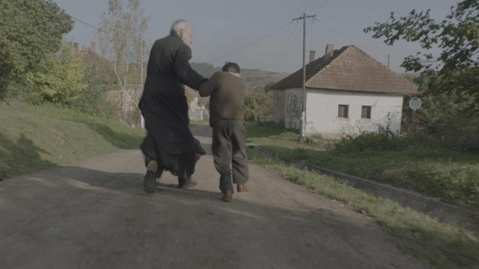](https://github.com/lalamax3d/vfx_nca_2020/)
- 02 - FG character 20-50    (2-4hour)
[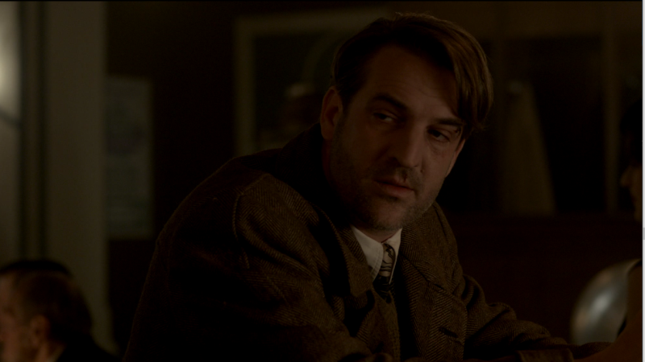](https://github.com/lalamax3d/vfx_nca_2020/)
- 03 - Car and first boy 50-90    (4-7hour)
[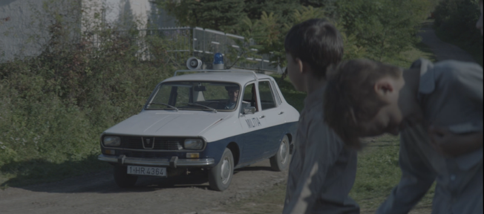](https://github.com/lalamax3d/vfx_nca_2020/)
- 04 - Character 1-30      (2-3hour)
[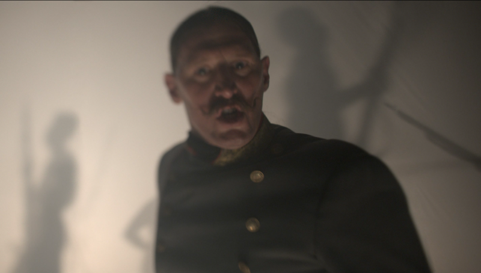](https://github.com/lalamax3d/vfx_nca_2020/)
- 05 - FG bike 1-30     (8-12hour)
[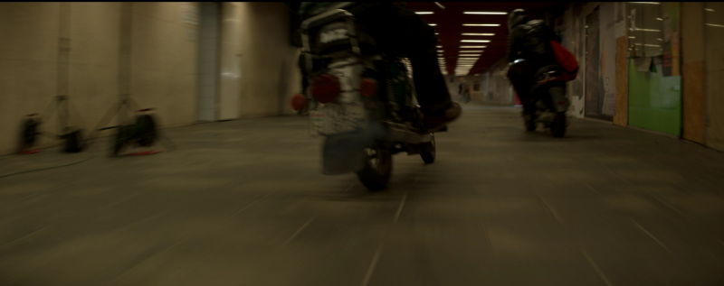](https://github.com/lalamax3d/vfx_nca_2020/)

# WEEK 02 (Tracking / More UI)

## LECTURE NOTES -
- Tracking Introduction
- Simple 4 point tracking workflow in AE
- Simple 4 point tracking workflow in Nuke

## EXERCISE
- 01 - easy, all 4 points visible
[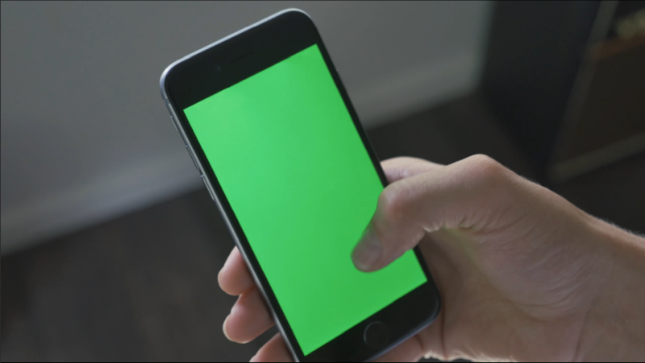](https://github.com/lalamax3d/vfx_nca_2020/)
- 02 - easy, pressing home button, 1 point is missing
[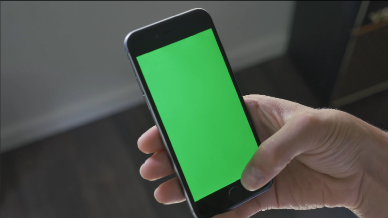](https://github.com/lalamax3d/vfx_nca_2020/)
- 03 - medium, try planer tracker from mocha or nuke here
[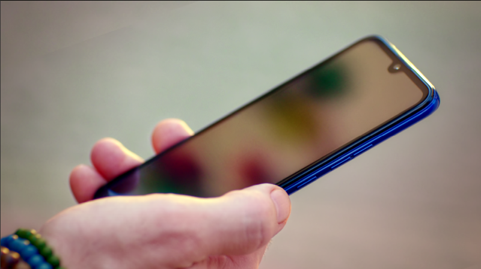](https://github.com/lalamax3d/vfx_nca_2020/)
- 04 - medium, try planer tracker from mocha or nuke here
[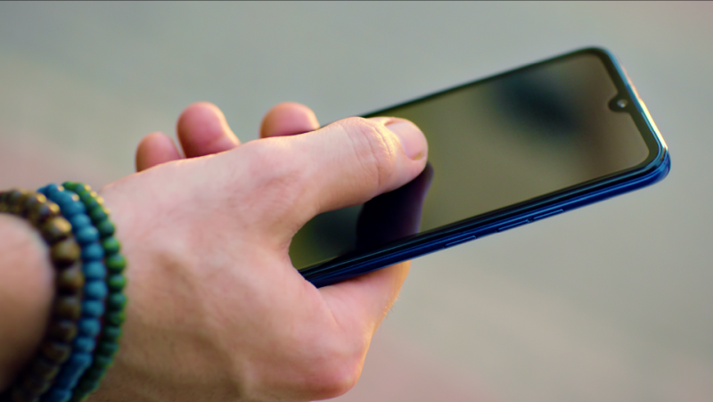](https://github.com/lalamax3d/vfx_nca_2020/)
- 05 - medium, try planer tracker from mocha or nuke here

# WEEK 03 (Prep - CleanUp)

## LECTURE NOTES -
- View shot few times / task notes
- plan how to do cleanup ( tracking / painting / etc )
- try finishing one frame
- repeat process on other frames (track / patch)

## EXERCISE
- 01 - easy, clean board, make it white glass/plastic
[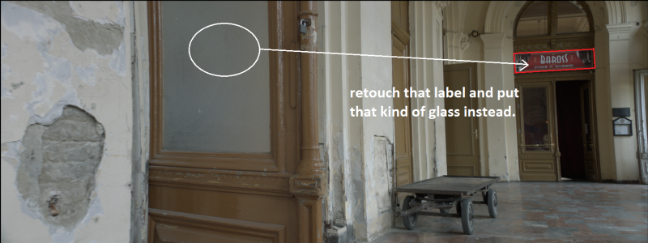](https://github.com/lalamax3d/vfx_nca_2020/)
- 02 - easy, remove billboards/ paint roof tops
[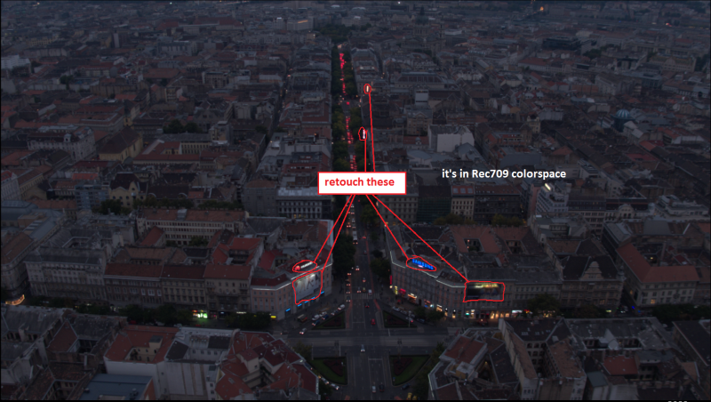](https://github.com/lalamax3d/vfx_nca_2020/)
- 03 - medium, clean logo on mobile screen(reflections)
[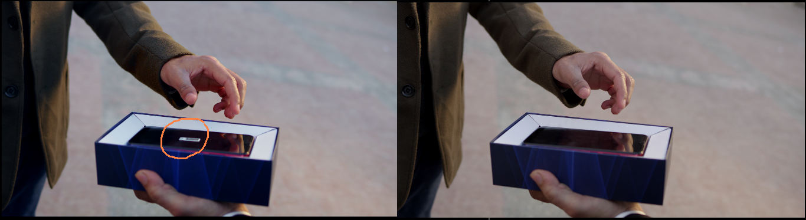](https://github.com/lalamax3d/vfx_nca_2020/)
- 04 - medium, clean logo on mobile screen2

- 05 - medium, remove wounds on face 
[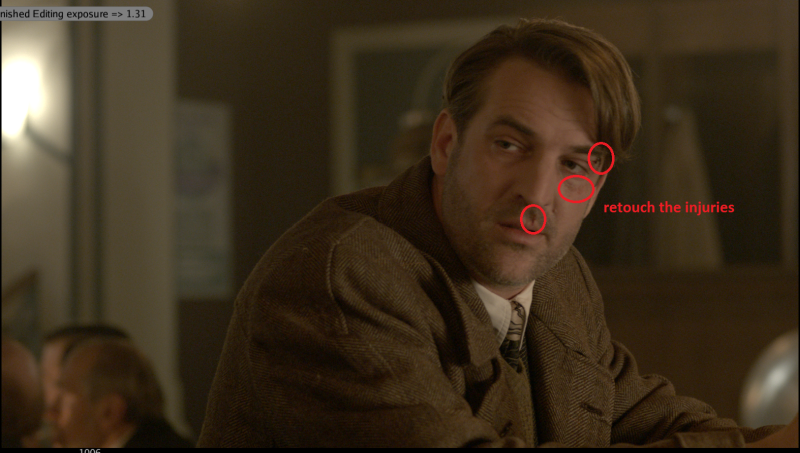](https://github.com/lalamax3d/vfx_nca_2020/)
- 06 - tough, clean logo on mobile screen
[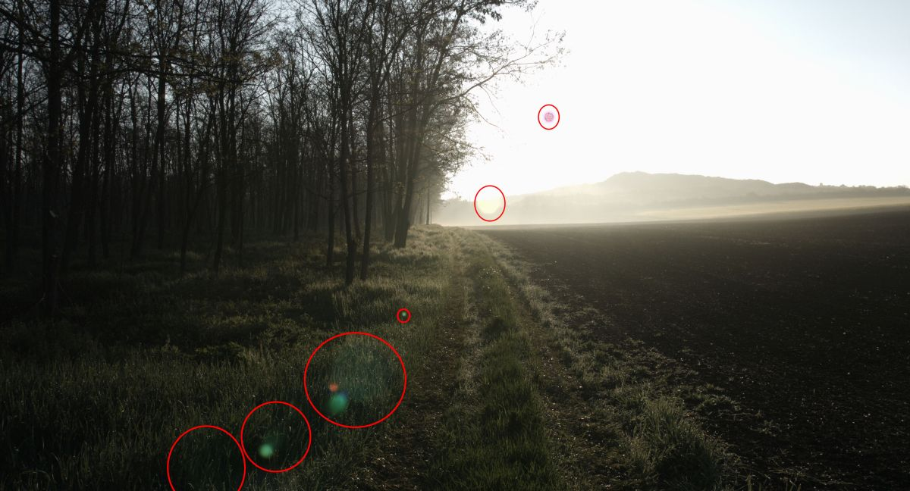](https://github.com/lalamax3d/vfx_nca_2020/)

# WEEK 04 (Design)
- intro to AE Text Engine
- intro to AE Shape Engine

## LECTURE NOTES -
- 
- 

## EXERCISE
- 06 - design simple 30 seconds intro

# WEEK 05 (Color / Keying)

## LECTURE NOTES -
- View shot few times / task notes
- plan how to do cleanup ( tracking / painting / etc )
- try finishing one frame
- repeat process on other frames

## EXERCISE
- 001 - mobile all 4 points visible
- 002 - mobile screen less points
- 003 - more production shots

# WEEK 06 (3D)

## LECTURE NOTES -
- View shot few times / task notes
- plan how to do cleanup ( tracking / painting / etc )
- try finishing one frame
- repeat process on other frames

## EXERCISE
- 001 - mobile all 4 points visible
- 002 - mobile screen less points
- 003 - more production shots

design

coloring / keying

particle
shading